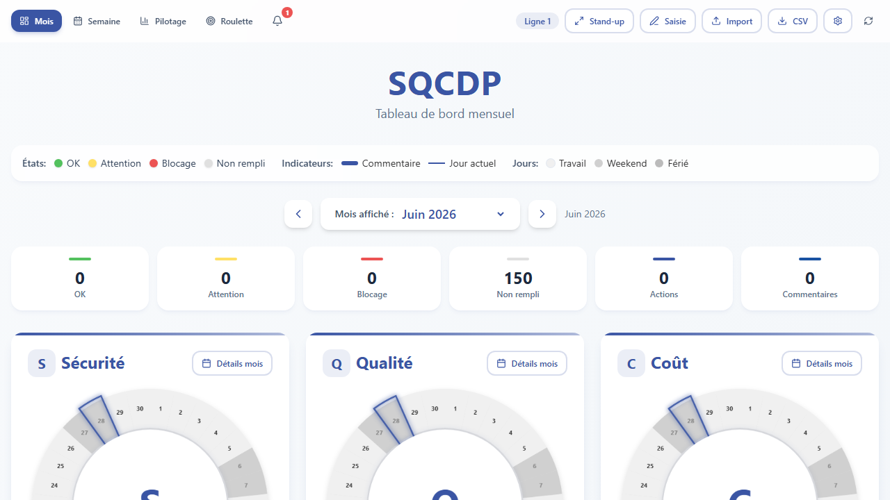

# SQCDP WebApp — Premium

[](https://github.com/dariohd/SQCDP/actions/workflows/ci.yml)
[](https://sqcdp.vercel.app)



> Backend API : Express + PostgreSQL (dossier `sqcdp-api` en local, déployé sur Render). Schéma : `database/schema.sql`.

Application SQCDP (Sécurité, Qualité, Coût, Délai, Personnel) — React + Vite + TypeScript.

| | |
|---|---|
| **URL production** | https://sqcdp.vercel.app |
| **Dépôt** | [github.com/dariohd/SQCDP](https://github.com/dariohd/SQCDP) |
| **Architecture** | [docs/ARCHITECTURE.md](docs/ARCHITECTURE.md) |

**Sans base de données côté client** : données via API Render + cache localStorage (offline/PWA).

## Fonctionnalités

- Tableau de bord mensuel (5 donuts interactifs animés)
- Vue **semaine** et **pilotage** (tendances, KPIs, benchmark équipes)
- **Mode Daily** guidé (ordre du jour, rôles, saisie, revue, clôture + compte-rendu)
- Actions **PDCA** + **8D**, modèles prédéfinis
- Alertes cliquables (retards, escalade, blocages)
- Filtrage par **équipe / ligne**
- Export **CSV** (PDCA inclus) / **PDF** mensuel
- Import CSV avec écrasement local
- Mode **Stand-up** interactif (plein écran + actions ouvertes)
- **Roulette** réunion (rôles distincts, historique, timer)
- Synchronisation offline (file d'attente + indicateur réseau)
- Journal d'audit local
- PWA hors-ligne
- Raccourcis clavier : `R` refresh, `I` import, `S` stand-up, `B` saisie, `N` alertes, `D` daily

## Démarrage

```bash
npm install
cp .env.example .env   # optionnel — Supabase auth + URL API
npm run dev
```

Variables : voir [.env.example](.env.example) (`VITE_SUPABASE_*`, `VITE_API_BASE_URL`).

## Scripts

```bash
npm run build      # production
npm run test:e2e   # Playwright
npm run preview    # preview build
```

## Démo CSV

Fichiers dans `demo-data/` — importer dans l'ordre 01 → 04 pour tester la synchro.

## Déploiement

- **Vercel** : https://sqcdp.vercel.app (auto-deploy `main`)
- **GitHub Actions** : build, tests E2E, GitHub Pages

Secrets CI : `SUPABASE_URL`, `SUPABASE_KEY`, `VITE_API_BASE_URL` (optionnel)

## Base de données

Le schéma PostgreSQL attendu est dans [`database/schema.sql`](../database/schema.sql) (monorepo local).
Le contrat REST est documenté dans [`database/API.md`](../database/API.md).

**Backend API** : voir [`sqcdp-api/README.md`](../sqcdp-api/README.md) (Node + Express + PostgreSQL).

L'app fonctionne dès maintenant avec fallback localStorage + file de sync si l'API n'est pas disponible.
